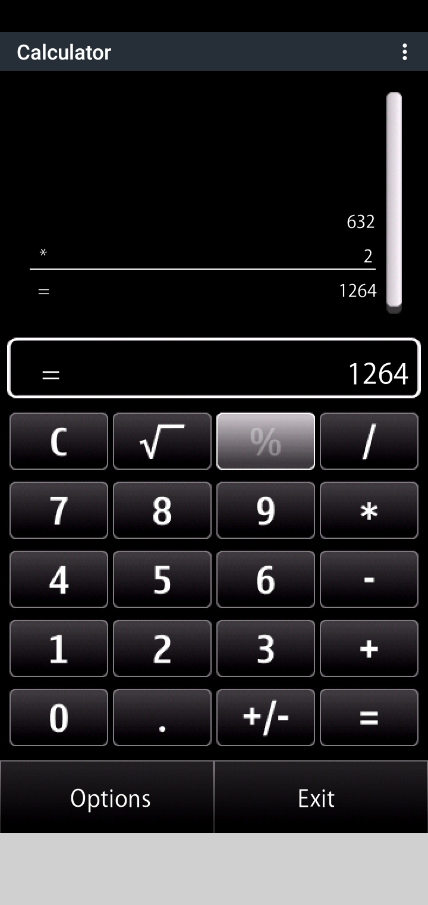
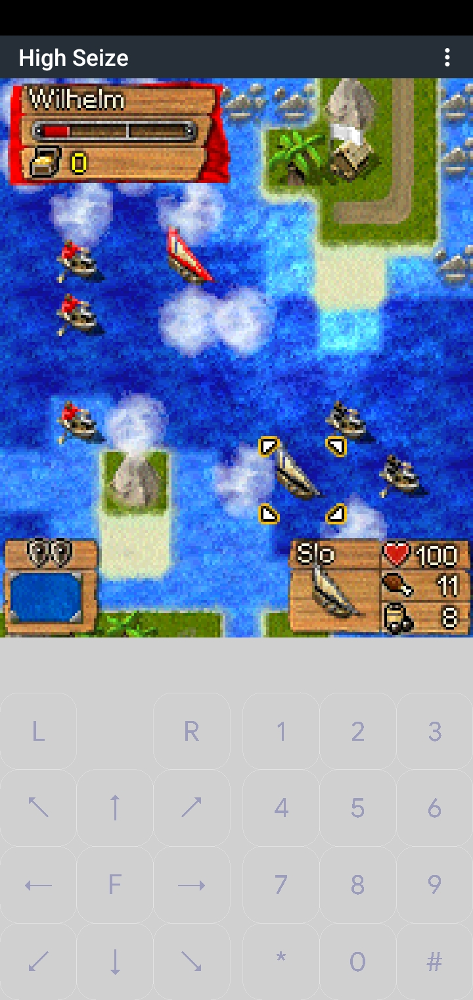
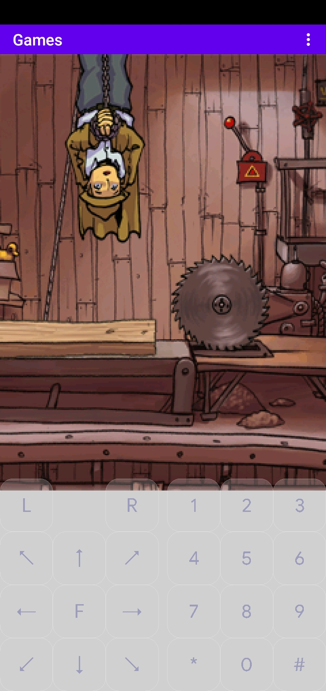
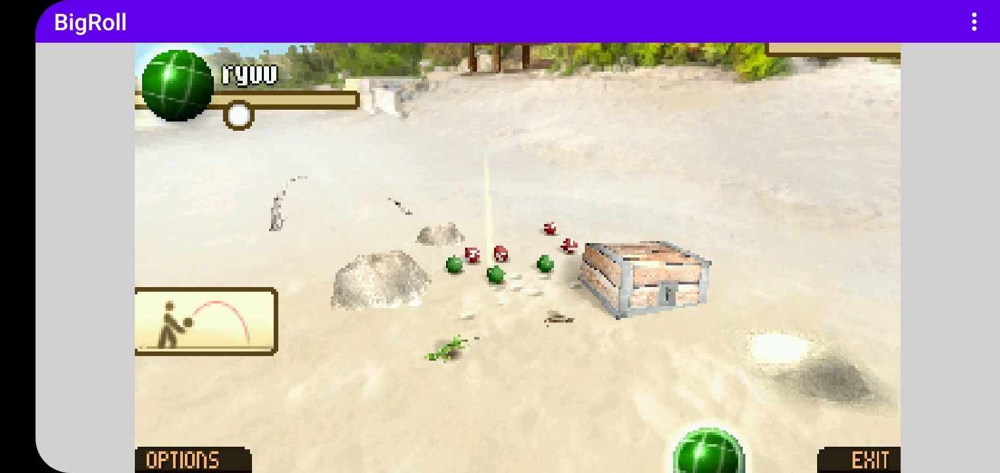
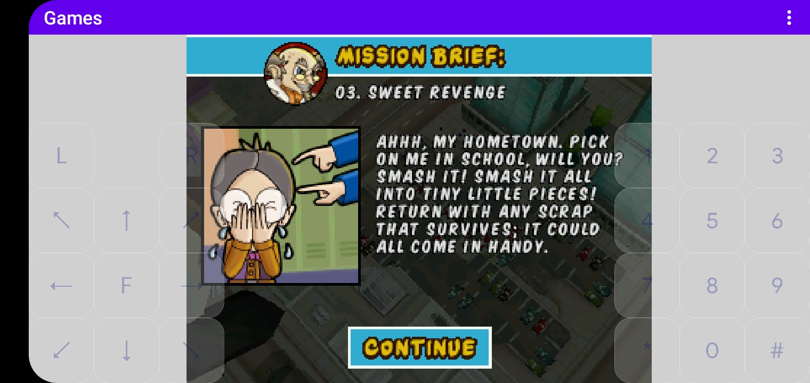

  

     
     <!-- Margin not working for some reasons! Tried to fix it by searching but not working! Feel free to submit a patch! -->
     &nbsp;
     <!-- Old link: https://femto.pw/rasu.gif -->
     
  

  

    
    
  

  <h3 align="center">Symbian OS/N-Gage emulator, written in C++ 17.</h3>

---

The emulator *emulates* Symbian OS/N-Gage's kernel, and *reimplement* most of its critical app servers and libraries. 

### Download Builds/Artifacts:

- Builds/Artifacts for Windows, OSX, Linux and Android are provided through Github Actions. Click on the [***Releases***](https://github.com/EKA2L1/EKA2L1/releases/tag/continous) section to get the newest stable build.

    - **Note:** There's no official maintainer for OSX and Linux versions of the emulator. Please report to the developers through issues if versions for these OSes are not working.

### Compatibility:
- At the moment the emulator supports:
    - Almost all official N-Gage/N-Gage 2.0 official libraries
    - Most of Symbian's game libraries from S60v1 to Symbian Belle
    - A limited subsets of Symbian applications.

- Compatibility for the games and software that can (and can't) run on the emulator can be verified [**here**](https://github.com/EKA2L1/Compatibility-List)

### Links

For more information, discussion and support, please visit these links:

- [**Homepage**](https://12l1.com/)
- [**Emulator Wiki**](https://eka2l1.miraheze.org/wiki/Main_Page)
- [**Discord server**](https://discord.gg/5Bm5SJ9)

### Screenshots

Calculator (5530)                                               |  High Seize                                                   |          Dirk Dagger
:--------------------------------------------------------------:|:-------------------------------------------------------------:|:-----------------------------------------------:
  |   | 

The Big Roll in Paradise                                 | Mega Monster       
:-------------------------------------------------------:|:-----------------------------------------------------------------:
 | 

### Donations

From 2022, developing the emulator has shifted to become a part-time hobby and sometimes not actively maintained in months, since the compatibility for most popular games and Symbian operating systems have been satisfied.

Still, if you feel like our work has benefited you much and you want to support or give us some cheers, feel free to donate to two developers that maintain the PC/Android version by visiting the **Sponsor this project** section of the Github page.

Visit this [link](https://12l1.com/quickstart/donation/) for more information.

  -------------
 *GIFs are provided by [**Stranno**](https://www.youtube.com/user/9esferas1)!*
 
 *Logo is designed and drawn by dmolina007 and Frenesi!*
