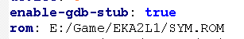
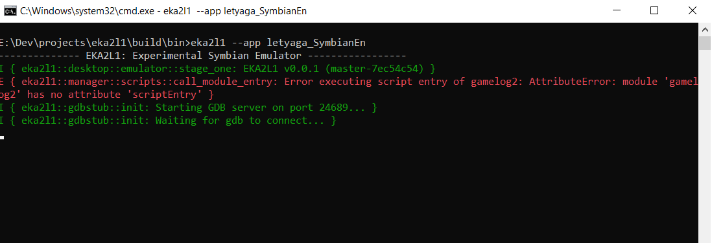
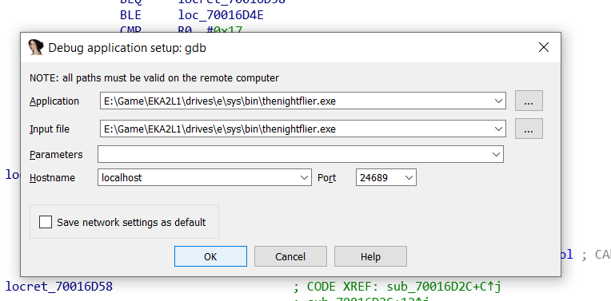
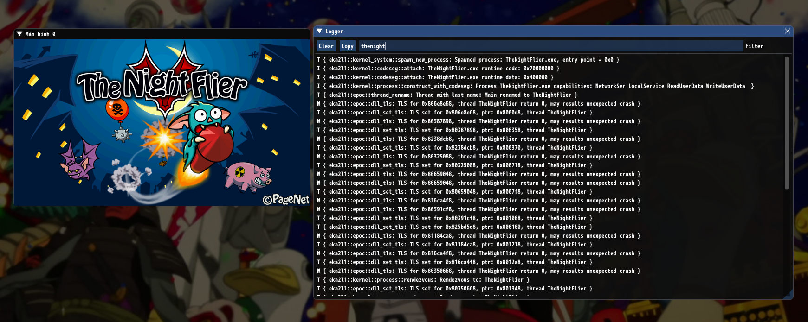
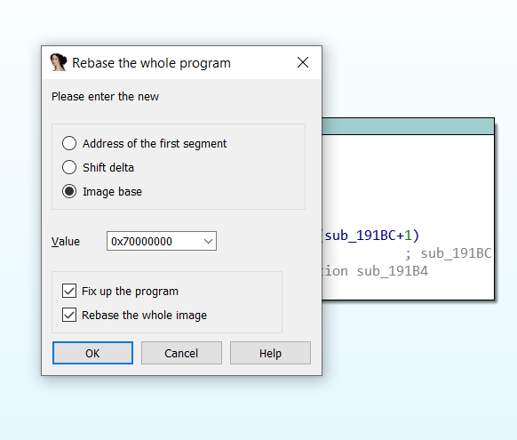
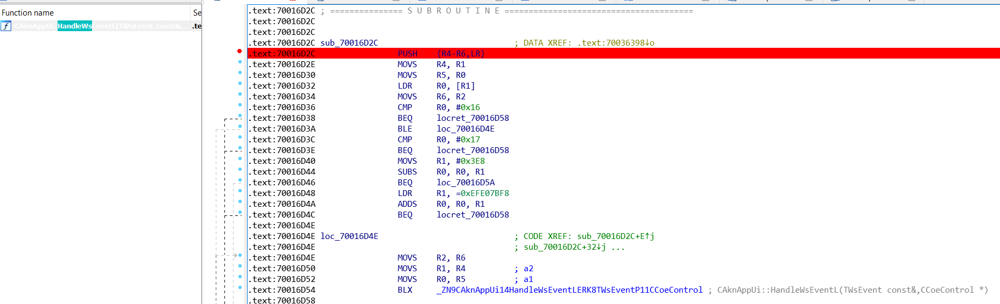
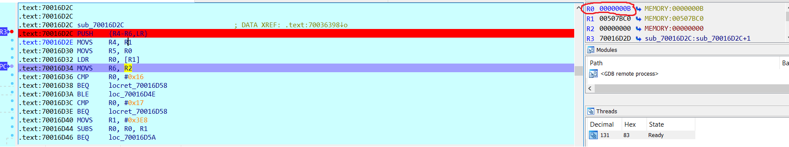
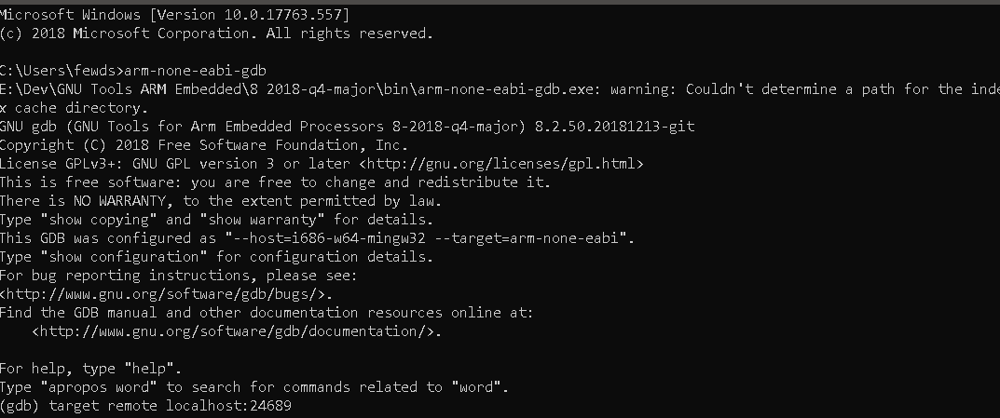
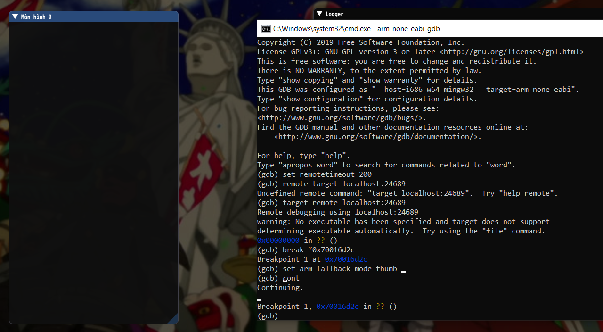

# Debugging with IDA

EKA2L1 has a *functional GDB stub with the Dynarmic JIT engine*. It means that you can hook up and debugging the whole EPOC system with IDA (plus GDB).

Here is list of supported features:

- **Software breakpoints**: Record a list of address that will pause the emulated system once the program counter of the CPU hit one of the address in the list. Use the *b/break* command in GDB and specify the execute breakpoint address.
   
- Segmentation faults are reported as well. Be careful.

**Note:** Although the image may have been outdated, the process stays the same.

## Get ready

If you want to use raw GDB, please make sure that your GDB version support ARM guest. You can download the ARM toolchain from ARM website, it contains
what you need on Windows, or just use gdb-multiarch in case you are on Unix-based system.

It's not possible to run gdb with a EPOC image yet. You must run gdb with no comment and connect it with EKA2L1.

First, make sure that in *config.yml*, option **enable-gdb-stub** is set to *true*.

*Note:* You can also adjust the port that your GDB/IDA will connect to with the option **gdb-port.** By default it's 24689, the same as being used in Citra.

Then, launch the emulator with program you wish to debug, or the program that spawns another program or loads an DLL you wish to debug.

In this example, I'm gonna launch the game **The Night Flier** by **PageNet. Soft**. It's executable is located in *E:/sys/bin/* with the name of **thenightflier.exe**.
We might keep that in mind for future purpose.

The emulator should now wait for a connection.... from somewhere!

## Use with IDA

Launch IDA, choose remote GDB backend for debug, and setup the process options like this:

The input and application fields should be leave by default. The port field should contains the GDB port displayed on EKA2L1 log screen. You can change it in *config.yml*.

Now let's try to rebase the program. Why? Normally the program does not rebase by itself, since it's limitation from both IDA and emulator part. This part needs
to be done in order for user to debug any non-ROM program. ROM program will be debuggable out of the box.

Notice the executable name mentioned earlier. Now let's try to run the game normally, without GDB stub enabled.
A search for the executable name in the log shows the code base of the executable.

That's the address we gonna use to rebase the entire image: **0x70000000**. Get back on IDA, and choose *Edit/Segments/Rebase program*:

That's almost done. Why are we launching the debugger without nothing to debug? Let's put a breakpoint somewhere.

I have set a new breakpoint at the subroutine which is supposed to handle application event delivered from Symbian.

Now launch EKA2L1 with that program as parameter, and launch the IDA debugger now :). Try to continue all the way, and...

The breakpoint hits! Here in the image I put another breakpoint, and has skipped to that breakpoint. You can see on the right panel
the value of some registers. The circled R0 here supposedly temporary stored the event type delivered to this game.

It's recommend for you to try it yourself more. Now if you get used to this in IDA, it's mostly the same in GDB, just more commands to
remember.

## Use with GDB

First, launch the GDB instance with ARM support, and connect it with the remote using `target remote localhost:<gdb_port>`.

The default port number is 24689, and if you set it yourself but forgot, EKA2L1 will remind it. Look at the log again.

From now feel free to use GDB commands. For example, let's set a breakpoint at that same address again (0x70016d2c). Since it's a Thumb breakpoint, you need to prepare:

- Set the fallback mode to Thumb. The command to set fallback mode is `set arm fallback-mode <arm/thumb>`, which depends on what type of breakpoint you want to set.
- Use the command `break \*0x<hex_address>` to set a breakpoint at that specific address.
- Since the launch time of EKA2L1 is not fast, it may got out of GDB's remote timeout. To extend the timeout, use the command `set remotetimeout <num_in_seconds>`. I use 200 in this example.

Following the step, and boom... It hits. Enjoy the time debugging!