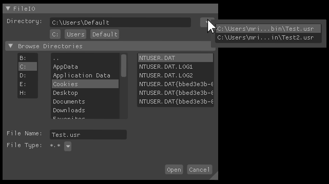
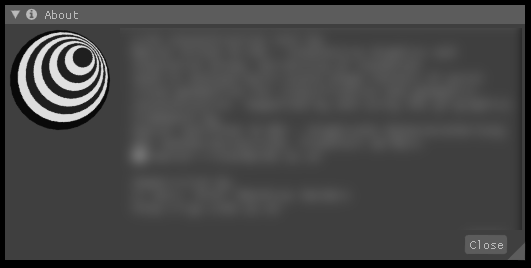
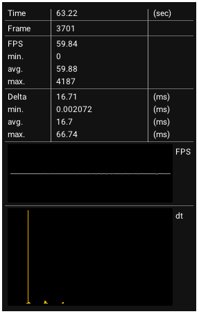
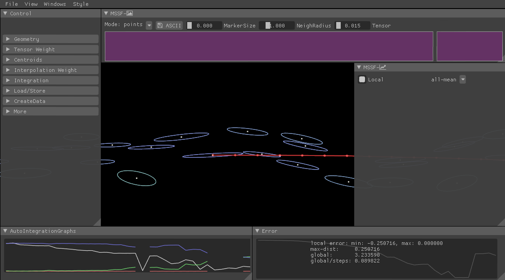

# Imgui-IGS-Snippets
Imgui code exchanges for convenience at IGS 

## Tested on
 * windows, mingw gcc 5.1.0 - cmake/ninja, imgui 1.49
 * ubuntu, gcc 5.4 - cmake/ninja, imgui 1.50

## FileIO Dialogue
 * similar to the standard windows file-io
 * additional recent file drop down
 * additional subdirectory buttons (linux style)

 
 
  * snippet example - save:
  ```c++
if( window_fileIO_visible )
{
    string save_file;
    if( fileIOWindow( save_file, window_recent_files, "Save", {"*.usr", "*.*"} ) )
    {
        window_fileIO_visible = false;
        if( !save_file.empty() )
        {
            window_recent_files.push_back( save_file );
 
            ofstream out_file;
            out_file.open( save_file, ios_base::trunc );          
            writeStuffToFile( out_file ); 
            out_file.close();
        }
    }
}  
  ```
  * snippet example - open:
  ```c++
if( window_fileIO_visible )
{
    string open_file;
    if( fileIOWindow( open_file, window_recent_files, "Open", {"*.usr", "*.*"}, true  ) )
    {
        window_fileIO_visible = false;
        if( !open_file.empty() )
        {
            window_recent_files.push_back( open_file );
            readStuffFromFile( open_file );
        }
    }
}	
  ```
  

## About Dialoge
 * text
 * close button
 * animated IGS logo
 
 
 
 * snippet example:
  ```c++
if( about_window_visible &&  
      aboutWindow( 
		ICON_FA_INFO_CIRCLE " About",
		"My fancy tools\n"
		"Abla bli blub ....\n",
		ImVec2( 400, 155 ),
		time ) )
		about_window_visible = false;
  ```


## Frameclock Statistic Dialogue
 * Overall Time
 * Framecounter
 * Frames per Second (current, min, avg, max)
 * Frametime (current, min, avg, max)
 * Frames per Second Plot over time
 * Frametime histogram

 

 * snippet example:
  ```c++
static FrameClock clock;

clock.beginFrame();

frameClockWindow(clock);

clock.endFrame();
  ```
  
  
## Grid Layout Helper 
 * Setup next window size and position according to a grid layout
 * Controlable grid divisions
 * Setup by pair of top-left and bottom-right grid coordinates with 4-letter string encoded mode
   * e.g. "ltlt" -> cell nr. left, top, left, top
   * e.g. "blbr" -> cell nr. bottom, left, bottom, right
   
 
 
 * snippet example:
  ```c++
GridLayout layout( 
	ImVec2( window_size.x, window_size.y ), // window size in pixels
	ImVec2( 10, 10 ),                       // grid divisions of 10 in x and y direction (default 10, 10)
	20 );                                   // height of a menu in pixel (default (20))

/* ... */

// call layout function before creating the next window
layout.placeNextWindow( ImVec2(0,0), ImVec2(2,2), "ltlb" );
ImGui::Begin("Control"); /* ... */ ImGui::End();
// meaning: 
//   - left-top corner of window at cell 0,0 
//     counted from left and top
//   - right-bottom corner of window at cell 2,2 
//     counted from left and bottom


layout.placeNextWindow( ImVec2(5,2), ImVec2(0,0), "lbrb" );
ImGui::Begin("Error"); /* ... */ ImGui::End();

layout.placeNextWindow( ImVec2(2,0), ImVec2(0,2), "ltrt" );
ImGui::Begin("MSSF-" ICON_FA_PICTURE_O ); /* ... */ ImGui::End();

layout.placeNextWindow( ImVec2(3,2), ImVec2(0,2),"rtrb" );
Begin( "MSSF-" ICON_FA_LINE_CHART  ); /* ... */ ImGui::End();

layout.placeNextWindow( ImVec2(0,2), ImVec2(5,0), "lblb" );
Begin("AutoIntegrationGraphs"); /* ... */ ImGui::End();
  ```